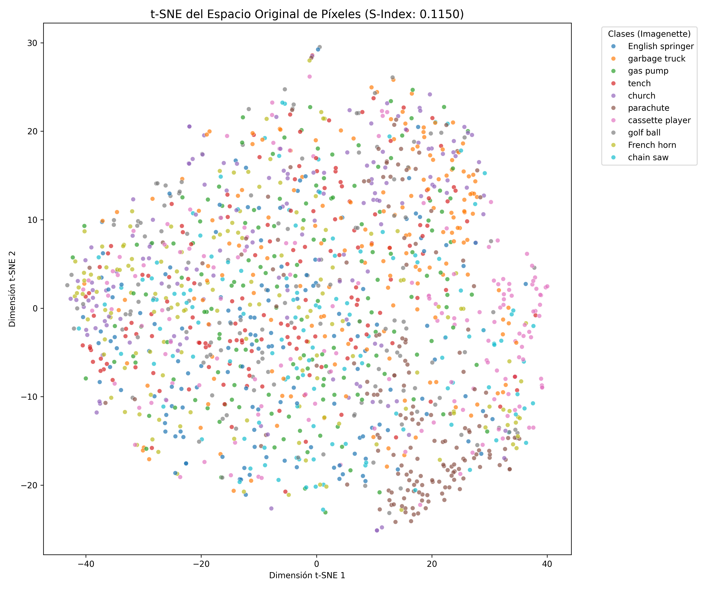
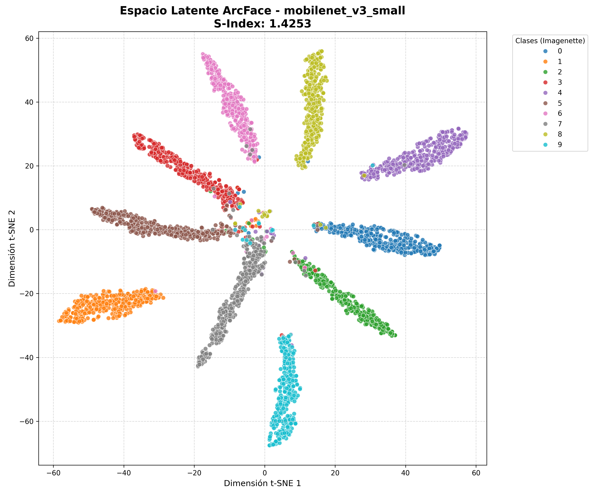

# Impacto de la Cuantización INT8 en la Topología de Espacios Latentes

Este repositorio contiene el framework experimental para la investigación titulada: "Impacto de la Metodología y Granularidad de Cuantización INT8 sobre la Representación Latente y Eficiencia Computacional en Redes Convolucionales Ligeras". El objetivo central es el análisis multiobjetivo mediante la construcción de un Frente de Pareto 3D que relacione la precisión predictiva, la eficiencia en hardware y la integridad topológica del modelo comprimido.

## Objetivo Científico
La investigación evalúa simultáneamente tres métricas críticas en arquitecturas convolucionales de baja latencia (MobileNetV3 y ShuffleNetV2):
1.  **Exactitud (Top-1 Accuracy):** Evaluación del rendimiento predictivo tras la reducción de precisión a 8 bits.
2.  **Eficiencia Computacional (Latencia):** Tiempo de inferencia medido en milisegundos (ms) sobre arquitectura CPU x86 (Intel/AMD).
3.  **Integridad Topológica (Índice S):** Cuantificación de la separabilidad en el espacio latente mediante distancias de coseno con normalización L2.

## Arquitectura del Sistema
El proyecto se estructura de forma modular para garantizar la reproducibilidad científica:

- **src/quantization/**: Implementación de flujos de cuantización PTQ y QAT utilizando el motor torch.ao.quantization.
- **src/topology/**: Módulos de extracción de características mediante Forward Hooks y cálculo del Índice S.
- **src/models/**: Factory de modelos para la carga de pesos FP32 y fusión de capas (Conv-BN-ReLU).
- **src/utils/**: Utilidades de benchmarking de latencia y gestión de logs experimentales.
- **data/**: Dataloaders optimizados para el cumplimiento de restricciones de memoria RAM (16GB).

## Configuración del Entorno de Investigación
La gestión de dependencias y entornos virtuales se realiza exclusivamente mediante **uv** (Astral).

### Requisitos del Sistema
- Python 3.9 o superior.
- Arquitectura CPU x86 (Target de inferencia INT8).
- GPU con 6GB VRAM (Requerida únicamente para la fase de entrenamiento QAT).

### Instalación y Ejecución
Para inicializar el entorno y sincronizar las dependencias definidas en pyproject.toml:
```bash
uv sync
```

Para ejecutar el pipeline de evaluación multiobjetivo:
```bash
uv run evaluate_pareto.py
```

## Gestión de Datos y Versionamiento
Este proyecto implementa **DVC** (Data Version Control) para el manejo de activos binarios en `data/raw` y `data/processed`, utilizando Google Drive como almacenamiento remoto.

# Reporte de Baselines y Análisis Topológico del Espacio de Representación

## 1. Análisis Exploratorio y Complejidad del Dominio (EDA)

El presente análisis evalúa la complejidad estructural del conjunto de datos **Imagenette** frente a conjuntos de baja resolución convencionales (como CIFAR-10). Las estadísticas extraídas evidencian un desafío topológico significativo: mientras que en imágenes de 32x32 la dispersión intra-clase máxima registrada fue de aproximadamente 14.2 (clase *automobile*), en Imagenette (224x224) la dispersión se dispara hasta 32.8 (clase *cassette player*). Esta alta varianza natural (fluctuaciones en iluminación, fondos y ángulos) dificulta severamente la agrupación en el espacio latente.

Para cuantificar esta complejidad, se analizó el espacio original de los píxeles (150,528 dimensiones) proyectándolo a 2D mediante t-SNE. 


*Figura 1: Proyección t-SNE del espacio crudo de píxeles. S-Index: 0.1150.*

Como se observa en la Figura 1, existe un solapamiento casi absoluto de las clases. La métrica de separabilidad topológica ($S_{sep}$) arrojó un valor de **0.1150**, lo que confirma matemáticamente la inseparabilidad lineal de los datos en su dominio base y justifica la necesidad de una arquitectura profunda para estructurar un espacio de representación útil.

---

## 2. Evaluación del Baseline Estándar (Entropía Cruzada)

Para establecer el grupo de control, se entrenó la arquitectura **MobileNetV3-Small** utilizando la función de pérdida estándar (*Cross-Entropy*) y optimización con *Cosine Annealing*. 

El modelo alcanzó una precisión de clasificación (Accuracy) del **97.86%** en Punto Flotante (FP32). Sin embargo, la evaluación topológica reveló una debilidad estructural crítica: el Índice de Separabilidad ($S_{sep}$) se estancó en **0.7699**. 

Un $S_{sep} < 1.0$ indica que la dispersión intra-clase supera a la distancia inter-clase. En términos geométricos, aunque el clasificador lineal logró trazar fronteras de decisión exitosas, los clústeres se encuentran peligrosamente cerca unos de otros. Esta topología frágil sugiere que el modelo es altamente vulnerable al ruido; cualquier perturbación, como el error de discretización introducido por una futura cuantización, cruzaría fácilmente estas fronteras estrechas.

---

## 3. Optimización Topológica con Margen Angular (ArcFace)

Para solucionar la vulnerabilidad del modelo estándar, se propuso un segundo *baseline* enfocado estrictamente en la robustez geométrica. Se reemplazó la capa de clasificación final por una capa de margen angular aditivo (**ArcFace**), configurando un margen estricto de $m=0.50$ para forzar una separación topológica severa. El modelo se guardó basándose únicamente en la maximización del $S_{sep}$.


*Figura 2: Proyección t-SNE del espacio latente optimizado con ArcFace. S-Index: 1.4253.*

Los resultados (Figura 2) demuestran una transformación radical del espacio de representación. El modelo logró comprimir la varianza interna de las clases y repeler los centroides, elevando el Índice de Separabilidad a **1.4253** (casi el doble del *baseline* estándar). Visualmente, se aprecian clústeres densos separados por márgenes vacíos definidos, confirmando que la distancia geométrica entre clases ahora supera la dispersión de sus muestras.

---

## 4. Conclusiones y Siguientes Pasos

El desarrollo de estos *baselines* permite concluir que un alto rendimiento en precisión (Accuracy) no garantiza un espacio latente estructurado o seguro. Mientras que el entrenamiento estándar produce fronteras frágiles ($S_{sep} = 0.76$), la optimización con funciones de pérdida topológicas como ArcFace blinda el modelo construyendo clústeres fuertemente separados ($S_{sep} = 1.42$).

El trabajo futuro se centrará en someter estos dos modelos (el frágil y el robusto) a **Cuantización Post-Entrenamiento (PTQ) a INT8**. La hipótesis empírica dictamina que el modelo optimizado con ArcFace absorberá el ruido de compresión sin degradación catastrófica, demostrando que el $S_{sep}$ es un predictor fiable de la viabilidad de un modelo para su despliegue en hardware restringido.

## Licencia
Este software se distribuye bajo la licencia MIT.